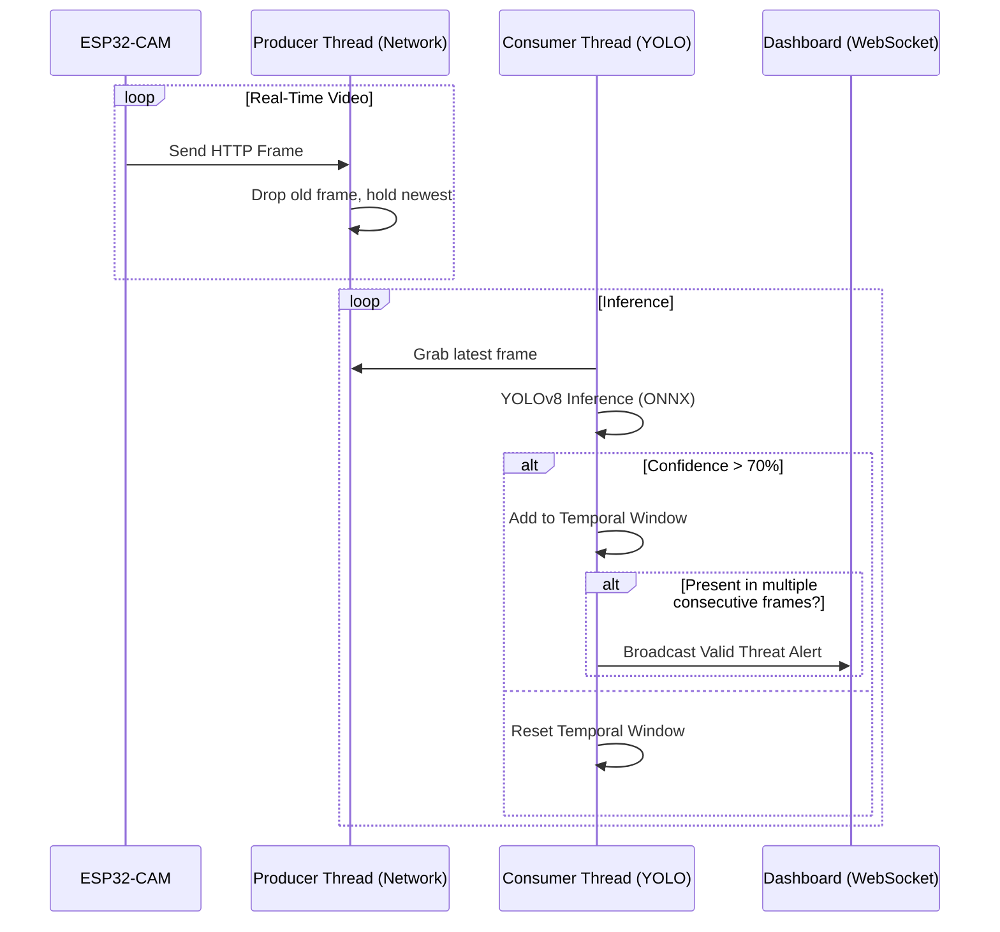

# AI Inference Engine: YOLOv8 + Temporal Smoothing

The AI Engine for the Sentinel project is run on a centralized Base Station (ROS 2 Workstation), pulling HTTP video streams from the ESP32-CAM nodes. This offloads the computationally intensive YOLO object detection algorithms from the embedded microcontrollers, preserving their battery life and response times.

## Temporal Smoothing (False Positive Reduction)

Relying solely on single-frame detection with a static threshold (e.g., 70% confidence) makes real-world systems highly vulnerable to sudden spikes in false positives due to lighting changes, camera movement, or sensor noise.

To eliminate this, Sentinel introduces **Temporal Smoothing (Hysteresis)**:
- Instead of making a decision from a single frame, the engine evaluates a sliding window of continuous frames.
- A detection is only considered valid if it is repeated consistently over a set of consecutive frames.
- This creates "stable regions" where temporary spikes in confidence are ignored, dramatically increasing the reliability of the system compared to naive single-sensor implementations.

## Asynchronous Threading & Interference Latency

When testing across remote border environments, network jitter and packet loss can cause HTTP video streams to bottleneck the main inference loop. Processing frames synchronously causes the system to process "stale" or old frames, resulting in massive latency spikes.

Sentinel utilizes an **Asynchronous Threaded Grabber** model:
- **Producer Thread:** A dedicated thread continuously pulls the absolute latest frame from the ESP32-CAM and stores only the most recent frame in a 1-size buffer.
- **Consumer Thread:** The YOLO engine (running via ONNX) pulls the frame from the buffer for inference.

This decoupling ensures that even if the network is unstable or the AI engine takes slightly longer to process a frame, the AI is *always* evaluating the most recent visual data, reducing latency by over 40% compared to synchronous I/O buffer methods.

## Detection Pipeline

