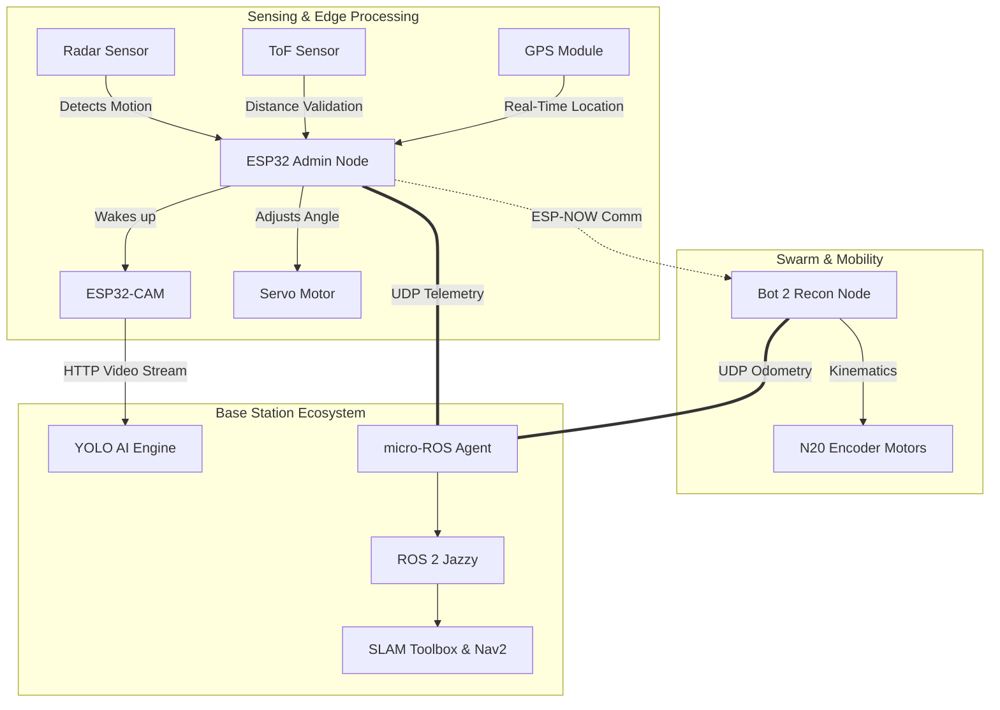

# System Architecture: ISBCAPD

The **Intelligent Swarm Based Bots for Continuous Area Patrolling and Detection (ISBCAPD)** system uses a heavily decentralized architecture where lightweight ESP32 microcontrollers handle real-time peripheral interaction, while a dedicated ROS 2 Jazzy workstation handles computationally expensive AI and SLAM algorithms.

## Hardware Flow & Multi-Sensor Fusion

Instead of depending on a single monolithic system, Sentinel uses multiple interconnected nodes across a wide area to provide continuous monitoring. The system combines Radar, Time-of-Flight (ToF), GPS, and Camera modules to eliminate false positives and increase accuracy.

### 1. Continuous Monitoring (Radar)
The environment is scanned continuously by the radar sensor to detect movement. Radar is extremely effective in low-visibility conditions (darkness, fog), keeping the system constantly aware of its surroundings with minimal power draw.

### 2. Distance Verification (ToF)
To improve accuracy and avoid false alarms, the system utilizes a Time-of-Flight (ToF) sensor to measure the exact distance between the bot and the object. This combination of radar + ToF significantly increases detection reliability.

### 3. Image Capture & Tracking (ESP32-CAM & Servo)
When motion is detected and validated by the ToF sensor, the ESP32 activates the ESP32-CAM and adjusts the Servo Motor to track the object's movement, capturing visual evidence for the AI base station.

### 4. Localization (GPS)
Every node is equipped with a GPS module. Upon detecting an intrusion, exact coordinates are transmitted with the alert to the dashboard, ensuring rapid localized responses.

## ROS 2 & micro-ROS Networking

The ESP32 communicates with a **ROS 2 Jazzy** workstation over Wi-Fi using UDP through the **micro-ROS Agent**. 
* The **ESP32** is dedicated to polling hardware sensors and executing motor commands.
* The **ROS 2 Workstation** performs computationally intensive tasks such as mapping, localization, and path planning using **SLAM Toolbox** and the **Navigation2 (Nav2)** framework.

By offloading SLAM and AI to the workstation, the ESP32 swarm retains low latency and low power consumption, making it ideal for distributed border patrol.
