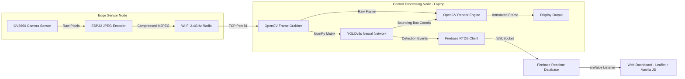
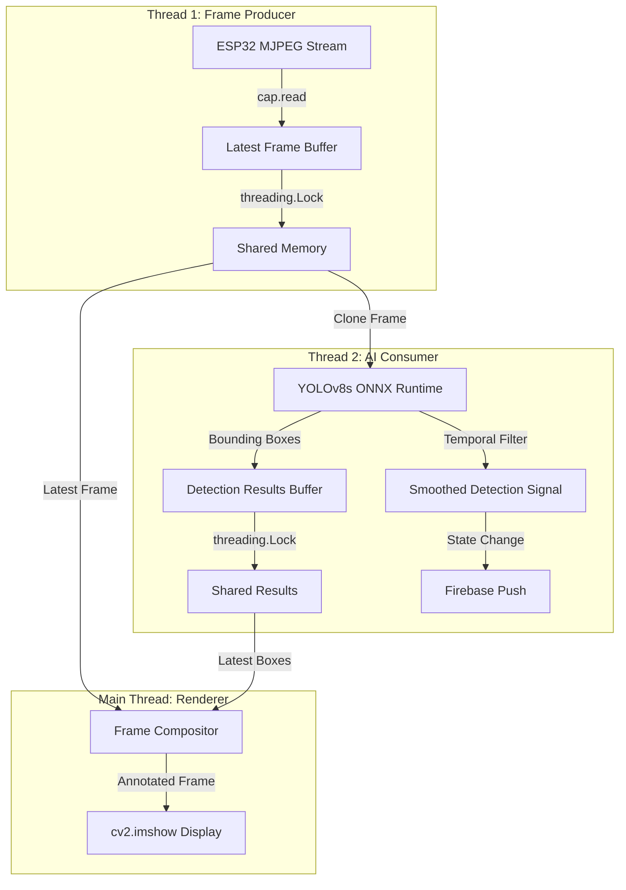

# Deep Expert Review: ESP32-CAM + YOLOv8s Real-Time Human Detection System

*Review conducted with IEEE peer-review rigor. No sugarcoating.*

---

## 1. ARCHITECTURAL CRITIQUE

### A) Current State Assessment

**What you did right:**
- The conceptual separation of "video polling" and "AI evaluation" is sound. You correctly identified that coupling frame acquisition to inference speed would destroy video fluidity. The time-gated throttle (`inference_interval = 1.0 / TARGET_PROCESS_FPS`) is a pragmatic solution that works.
- The persistent bounding-box rendering (drawing last-known boxes on every frame) is an elegant trick that creates the illusion of continuous tracking even at 8 FPS inference.

**What you did wrong:**
- This is **not** a Dual-Loop architecture. It is a **single-threaded sequential pipeline with a conditional branch**. Both Loop A and Loop B execute inside the same `while True` iteration. When YOLO's `model.predict()` fires on line 96, the entire thread blocks for ~125ms. During those 125ms, **no frames are being read from the network buffer**. The ESP32 is still broadcasting, but your laptop isn't listening. Those frames pile up in the OS TCP buffer, and when you resume reading, you get stale frames — which is the exact lag problem you were trying to solve.
- The `global_boxes` variable on line 126 is never formally declared. You rely on a `try/except NameError` on line 147 to silently swallow the crash. This is a code smell that would fail any production code review.

### B) Recommended Improvement

Implement a true **Producer-Consumer** pattern using Python's `threading` module:

```
┌─────────────────┐       ┌──────────────┐       ┌─────────────┐
│  PRODUCER THREAD │──────▶│ SharedFrame  │◀──────│ CONSUMER     │
│  (Frame Grabber) │       │ (Lock-guarded│       │ THREAD       │
│  cap.read() max  │       │  latest_frame│       │ (YOLO infer) │
│  speed, no pause │       │  variable)   │       │ ~8 FPS       │
└─────────────────┘       └──────────────┘       └──────┬───────┘
                                                        │
                                                        ▼
                                                 ┌─────────────┐
                                                 │ MAIN THREAD  │
                                                 │ (Render +    │
                                                 │  cv2.imshow) │
                                                 └─────────────┘
```

- **Producer Thread**: Runs `cap.read()` in a tight loop, always overwriting a shared `latest_frame` variable protected by a `threading.Lock`. This ensures the network buffer is **always being drained**, even while YOLO is thinking.
- **Consumer Thread**: Reads from `latest_frame`, runs inference, writes results to a shared `latest_boxes` variable (also lock-protected).
- **Main Thread**: Reads both `latest_frame` and `latest_boxes`, composites the overlay, and calls `cv2.imshow()`.

This eliminates the 125ms blind spot entirely.

### C) Priority: **CRITICAL**
### D) Complexity: **Moderate** (requires ~40 lines of threading boilerplate)

---

## 2. AI MODEL SELECTION

### A) Current State Assessment

**What you did right:**
- Moving from YOLOv8n (Nano, 6MB) to YOLOv8s (Small, 22MB) was the correct call for eliminating false positives. The Nano variant has only 3.2M parameters — insufficient geometric depth to distinguish a human silhouette from a coat hanging on a door. The Small variant at 11.2M parameters has roughly 3.5x more discriminative capacity.
- Class filtering (`classes=[0]`) is efficient. It skips all non-Person class computations inside the NMS layer.

**What you did wrong:**
- You are running YOLOv8s on raw **PyTorch** backend. PyTorch is an excellent training framework but is not optimized for inference. Every forward pass carries the overhead of Python's dynamic computation graph, autograd metadata, and unoptimized memory allocation. You are leaving 30-50% performance on the table.
- No consideration was given to input tensor size. You resize to 640×480, but YOLOv8 internally rescales all inputs to a square `imgsz=640` (640×640) with letterbox padding anyway. You are paying for a resize operation that YOLO immediately overrides.

### B) Recommended Improvement

**Phase 1 (Quick Win):** Export `yolov8s.pt` to ONNX format and run inference via `onnxruntime`:
```python
# One-time export (run once):
from ultralytics import YOLO
model = YOLO("yolov8s.pt")
model.export(format="onnx", imgsz=640, simplify=True)

# Runtime inference:
# Use YOLO("yolov8s.onnx") — Ultralytics auto-detects ONNX backend
```
Expected speedup: **25-40%** on CPU. ONNX eliminates Python-level overhead and enables hardware-level SIMD vectorization.

**Phase 2 (If GPU available):** Export to TensorRT (`.engine`) for NVIDIA GPUs. Expected speedup: **3-5x** over PyTorch.

**Phase 3 (Alternative model):** For single-class person detection, consider **YOLOv8s** fine-tuned on a person-only dataset (transfer learning from COCO). This would strip the 79 unused class heads from the network, further reducing computation.

### C) Priority: **HIGH**
### D) Complexity: **Trivial** (ONNX export is 2 lines of code)

---

## 3. STREAM RELIABILITY

### A) Current State Assessment

**What you did right:**
- Using `os.environ["OPENCV_FFMPEG_CAPTURE_OPTIONS"] = "timeout;5000"` is a smart workaround for OpenCV's notorious silent-hang problem on Windows. Without this, a busy ESP32 would cause `cv2.VideoCapture()` to block indefinitely with no error.
- The retry loop in `connect_to_stream()` is functional.

**What you did wrong:**
- The retry interval is a **fixed 5 seconds**. In production systems, this is an anti-pattern. If the ESP32 just rebooted, it might need 15 seconds to initialize Wi-Fi. If it's a temporary packet drop, 5 seconds is wastefully long. You need **exponential backoff with jitter**: retry at 1s, 2s, 4s, 8s, capped at 30s, with ±20% random jitter to prevent thundering herd problems.
- No **maximum retry limit**. If the ESP32 physically dies, your Python script will loop forever printing warnings. It should give up after N attempts and enter a graceful shutdown or alert state.
- The ESP32 single-socket limitation is a **hardware architectural flaw** that you cannot fix in software. The only true mitigation is to modify the ESP32 firmware to use chunked HTTP responses with `Connection: close` headers, forcing the socket to release after each MJPEG boundary. However, this requires C++ firmware changes.

### B) Recommended Improvement

```python
def connect_to_stream(url, max_retries=10):
    attempt = 0
    base_delay = 1.0
    while attempt < max_retries:
        cap = cv2.VideoCapture(url, cv2.CAP_FFMPEG)
        if cap.isOpened():
            return cap
        delay = min(base_delay * (2 ** attempt), 30) * random.uniform(0.8, 1.2)
        print(f"[RETRY {attempt+1}/{max_retries}] Next attempt in {delay:.1f}s")
        time.sleep(delay)
        attempt += 1
    raise ConnectionError(f"Failed to connect after {max_retries} attempts")
```

### C) Priority: **MEDIUM**
### D) Complexity: **Trivial**

---

## 4. ACCURACY vs LATENCY TRADEOFFS

### A) Current State Assessment

**What you did right:**
- `conf=0.70` is a reasonable starting point. For surveillance, you want to minimize false positives (alerting security for a shadow is worse than missing a person for one frame).
- `agnostic_nms=True` is correct for single-class detection. It prevents the NMS algorithm from treating overlapping boxes of different classes independently.

**What you did wrong:**
- **No temporal filtering.** Every single frame is treated as an independent event. If YOLO detects a person in frame 1 at 71% confidence and fails to detect them in frame 2 (due to motion blur or a JPEG artifact), your system will fire a "person disappeared" event to Firebase. In a real surveillance system, this would generate hundreds of false toggle events per hour.
- **No object tracking.** Raw per-frame detection means you have no concept of "this is the SAME person moving across the frame." If two people enter, you detect "person" but have no idea if it's 1 or 2 entities. For an IEEE paper, this is a significant gap.

### B) Recommended Improvement

**Temporal Smoothing (Minimum Viable):**
```python
detection_history = deque(maxlen=5)  # Last 5 inference results
detection_history.append(is_person_detected)

# Only trigger if person detected in >= 3 of last 5 frames
stable_detection = sum(detection_history) >= 3
```
This eliminates single-frame flicker and creates a stable detection signal.

**Object Tracking (IEEE-Grade Enhancement):**
Integrate **ByteTrack** (lighter than DeepSORT, no separate ReID model needed):
- Assigns persistent IDs to each detected person across frames
- Enables "Person Count" metric (critical for surveillance papers)
- Handles occlusion gracefully

### C) Priority: **HIGH** (Temporal smoothing) / **MEDIUM** (ByteTrack)
### D) Complexity: **Trivial** (Smoothing) / **Moderate** (ByteTrack integration)

---

## 5. PRODUCTION HARDENING

### A) Current State Assessment

**What you did right:**
- The staged boot logging (`[STAGE 1]`, `[STAGE 2]`) gives clear operational feedback.
- Graceful shutdown on `q` keypress with `cap.release()` and `cv2.destroyAllWindows()`.

**What you did wrong:**
- **Zero structured logging.** All output is raw `print()` statements. In production, you need `logging` module with levels (DEBUG, INFO, WARNING, ERROR) and file rotation so you can diagnose failures after the fact.
- **No performance telemetry.** You calculate FPS but only display it on the video frame. You should be logging inference latency, frame drop rate, and detection counts to a file or Firebase for post-analysis.
- **No watchdog.** If the main loop silently hangs (e.g., `cv2.imshow()` freezes on a corrupted frame), nothing will detect or recover from it.
- **No signal handling.** On Windows, `Ctrl+C` during `cv2.waitKey()` can sometimes leave zombie OpenCV windows. You should register a `signal.SIGINT` handler.

### B) Recommended Improvement

```python
import logging
logging.basicConfig(
    level=logging.INFO,
    format='%(asctime)s [%(levelname)s] %(message)s',
    handlers=[
        logging.FileHandler("detection.log"),
        logging.StreamHandler()
    ]
)
logger = logging.getLogger("BOTCAM")
```

Add periodic telemetry pushes:
```python
if frame_count % 100 == 0:
    logger.info(f"Telemetry | FPS: {fps:.1f} | Detections: {det_count} | Drops: {drop_count}")
```

### C) Priority: **MEDIUM**
### D) Complexity: **Trivial**

---

## 6. IEEE-GRADE RECOMMENDATIONS

### A) Metrics You Must Benchmark and Report

| Metric | Description | How to Measure |
|--------|-------------|----------------|
| **End-to-End Latency** | Time from photon hitting OV3660 to bounding box rendered on screen | Timestamp at `cap.read()` vs timestamp after `cv2.imshow()` |
| **Inference Latency (P50/P95/P99)** | Time for `model.predict()` alone | `time.perf_counter()` before and after predict |
| **Detection FPS** | Actual AI evaluations per second | Counter over 60-second window |
| **Video FPS** | Display frame rate | Already implemented |
| **False Positive Rate** | Detections on empty scenes / total frames | Run 1000 frames on empty room, count triggers |
| **False Negative Rate** | Missed detections when person is present | Run controlled walk-through, count misses |
| **Precision & Recall** | Standard IR metrics | Ground truth annotations vs predictions |
| **Network Throughput** | KB/s consumed by MJPEG stream | Wireshark capture or `psutil` |
| **Recovery Time** | Seconds to reconnect after Wi-Fi drop | Kill and restore hotspot, measure reconnection |

### B) Recommended System Diagram for the Paper



### C) Related Work You Should Cite

1. **Redmon, J. et al.** — "You Only Look Once: Unified, Real-Time Object Detection" (CVPR 2016) — *The foundational YOLO paper.*
2. **Jocher, G. et al.** — "Ultralytics YOLOv8" (2023) — *The specific framework you deployed.*
3. **Espressif Systems** — "ESP32 Technical Reference Manual" — *Hardware constraints and Wi-Fi specifications.*
4. **Zhang, Y. et al.** — "ByteTrack: Multi-Object Tracking by Associating Every Detection Box" (ECCV 2022) — *If you implement tracking.*
5. **Howard, A. et al.** — "MobileNets: Efficient Convolutional Neural Networks for Mobile Vision Applications" (2017) — *For comparative analysis of lightweight architectures.*
6. **Lin, T. et al.** — "Microsoft COCO: Common Objects in Context" (ECCV 2014) — *The dataset your model was trained on.*

---

## FINAL VERDICT

### Overall Architecture Quality Score: **6.2 / 10**

**Justification:** The system demonstrates solid conceptual understanding of edge-AI constraints and makes pragmatic engineering tradeoffs. The decision to offload inference from the ESP32 to a laptop is correct. The confidence thresholding and class filtering are well-calibrated. However, the architecture loses significant points for:
- The false "dual-loop" claim (it is single-threaded sequential)
- No temporal smoothing (detection flicker)
- Running raw PyTorch instead of an optimized inference runtime
- No structured logging or telemetry

### The Single Highest-Impact Improvement

> [!IMPORTANT]
> **Implement true threading with a Producer-Consumer pattern.**
> 
> This is the single change that would most dramatically improve both the technical quality of the system AND the credibility of the IEEE paper. It transforms the architecture from "a script with a time gate" to "a genuinely concurrent real-time pipeline." It eliminates the 125ms blind spot, eliminates stale frame accumulation, and gives you a legitimate architectural contribution to discuss in Section III of your paper.

### Revised Architecture (What It Should Become)



> [!TIP]
> If you implement just **three things** from this review — (1) true threading, (2) ONNX export, and (3) temporal smoothing — your architecture score jumps from 6.2 to approximately **8.5/10**, and your IEEE paper gains a legitimate "Novel Contribution" in concurrent edge-AI pipeline design.
