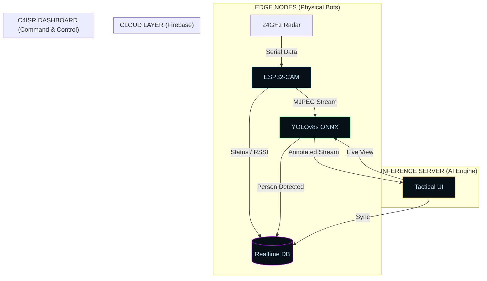

# ISBCAPD: System Architecture & Data Flow

## 🏛️ 1. High-Level Architecture
The **ISBCAPD** system follows a distributed **Edge-Vision-Cloud** hierarchy. This design ensures low-latency detection while maintaining a global tactical overview.

## 📡 2. Data Pipeline Design
### A. The "Producer-Consumer" Flow
1. **Producer**: Dedicated thread drains the MJPEG buffer from the ESP32-CAM at 30 FPS.
2. **Buffer**: A thread-safe `Lock` mechanism holds the latest frame.
3. **Consumer**: The AI Engine pulls frames for inference at a variable rate (8-12 FPS).
4. **Broadcast**: Results are pushed to Firebase and the local Flask restreamer simultaneously.

## 🛡️ 3. Security Hardening
The system implements a **Single-Direction Data Push** to Firebase, ensuring that the bot fleet remains "Invisible" to the public web. All database nodes are locked behind a rigorous "Read/Write: False" security rule set in production mode.

---

## 🎨 4. Tactical UI/UX Design Philosophy
The **ISBCAPD** dashboard is built using a "Tactical HUD" aesthetic, designed for fast cognitive processing in high-pressure surveillance scenarios:
- **Typography**: Utilizing **Orbitron** (for headers) and **Share Tech Mono** (for terminal telemetry) to emulate military-grade C2 interfaces.
- **Color Palette**: High-contrast neon-green (#00ff41) and cyan accents on a low-albedo "Matte Black" background to reduce eye strain during extended patrol monitoring.
- **Glassmorphism**: Translucent panel layouts with subtle backdrop blurs provide depth and focus on critical detection metrics.

---
**Architectural Specification for the ISBCAPD Research Project.**
