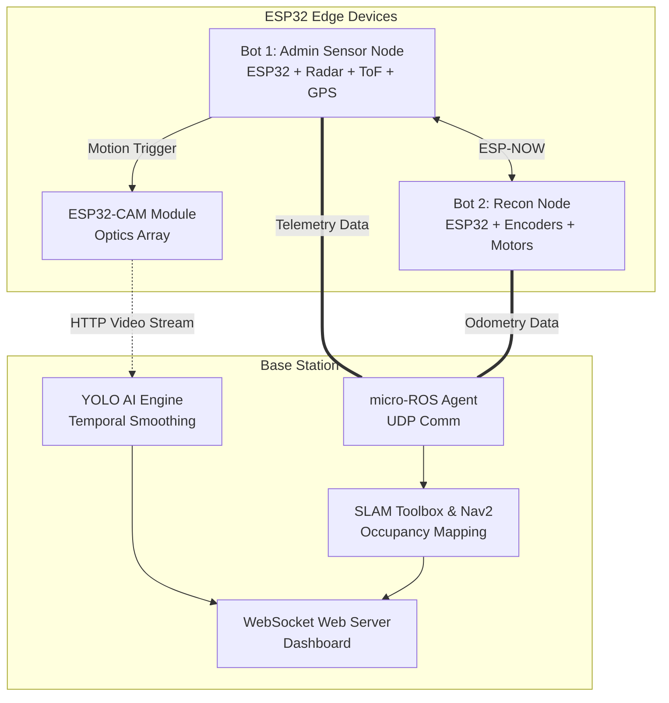

# Intelligent Swarm Based Bots for Continuous Area Patrolling and Detection (ISBCAPD)

> **Abstract:** Border surveillance is a major factor in national security. Traditional methods often suffer from limited coverage, high operational costs, and delayed response times. **ISBCAPD** (Sentinel) presents a smart border surveillance system using ESP32-based swarm nodes integrated with multi-sensor fusion (Radar, Time-of-Flight (ToF), GPS, and Camera modules). 

This system provides real-time monitoring by detecting motion, capturing optical data, and verifying intrusions using sensor fusion and lightweight YOLO object detection. The architecture operates in a swarm, allowing distributed processing and localized data communication. By integrating **micro-ROS** on the ESP32 and **ROS 2 Jazzy** for centralized SLAM and path planning, the system acts as a highly scalable, fault-tolerant, and power-efficient edge security solution.

---

## Key Features

1. **Swarm Intelligence & Edge Processing:** Decentralized architecture where ESP32 microcontrollers process immediate threats locally and share telemetry with a centralized ROS 2 workstation for heavy computation.
2. **Multi-Sensor Fusion (Radar + ToF + Optics):** 
   - **Radar:** Scans for motion continuously in all weather conditions.
   - **ToF Sensor:** Verifies the physical distance of the detected motion to prevent environmental false alarms.
   - **ESP32-CAM:** Captures visual proof of the intrusion for YOLOv8 AI inference.
3. **ROS 2 & micro-ROS Integration:** Embedded bots communicate with a ROS 2 Jazzy workstation via UDP. Enables advanced SLAM (Simultaneous Localization and Mapping) and Navigation2 capabilities.
4. **Temporal AI Smoothing:** YOLO-based object detection utilizes multi-frame temporal hysteresis (smoothing) to eliminate false positives caused by shadows, lighting changes, or network jitter.
5. **Real-Time GPS Telemetry & Dashboard:** A WebSocket-powered web dashboard (Web UI) monitors the swarm, visualizing live optics, radar fields, and exact GPS coordinates of intrusions.

---

## High-Level Swarm Architecture

The following diagram illustrates how the ESP32 bots function within the overarching ROS 2 ecosystem:

---

## Directory Structure

* `bot1/` — Core firmware for the primary ESP32 Admin Node (handles sensors). Includes all staging codes inside `stage_codes/`.
* `bot2/` — Firmware for the Subordinate Recon Node (handles motor kinematics).
* `esp32_slam_bot/` — Integrated SLAM configuration firmware.
* `AI_ENGINE/` — Contains the Python-based YOLO object detection scripts with temporal smoothing and threading logic.
* `ARCHITECTURE/` — Detailed architecture documentation and hardware diagrams.
* `DASHBOARD/` — HTML/JS based WebSocket dashboard for system monitoring.
* `FIRMWARE/` — Core libraries, ESP32-CAM code, and legacy tests.

---

## Academic Reference
This project was developed as a comprehensive engineering solution for advanced border security, emphasizing the shift from centralized monolith architectures to distributed IoT swarm ecosystems.

**Authors:** Ashwin Suresh | Neha Raj | Preetham Krishan K J | Vaishak D Karkera  
**Guide:** Mrs. Mehnaz Fathima C.
